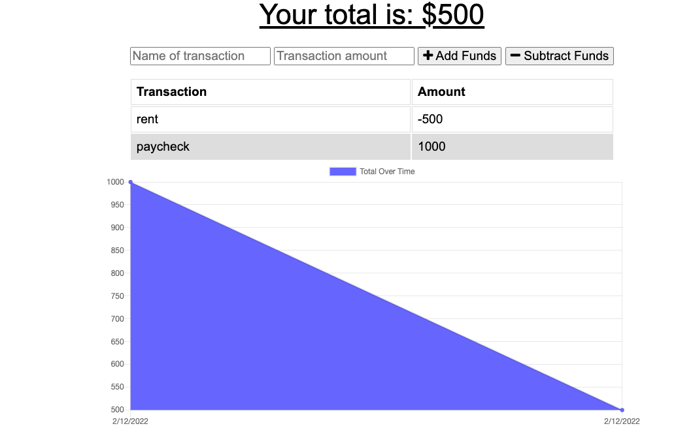

   
  # budgettrackerpwa
  ### A budget tracker for travelers in remote locations with limited connection to cell service.  This budget tracker app works with or without internet/cell connection. Giving users a fast and easy way to track their money and allowing them to access that information at any time.
  
  

  ## Installation/ Usage
  visit https://git.heroku.com/desolate-wave-76805.git directly or heroku open from terminal
  
  ##
## License  https://opensource.org/licenses/MIT
  ## Contact/Questions
  You can reach me for additional questions at:
  * GitHub: https://github.com/dawnleblanc11/budgettrackerpwa
  * Heroku: https://github.com/https://git.heroku.com/desolate-wave-76805.git
  * Email: dawnleblanc11@gmail.com
## Technology   
  * HTML/ CSS/ MongoDB/ MongoDB Atlas/ Moongoose/ Morgan
  * Express/ Compression/ Heroku/ Liteserver
  * PWA- Manifest/ Serivce Worker/ Cache/ Indexed DB 
  ## Features
  * User can input a deposit or withdrawal
  * Application will keep a running balance total
  * Application with function regardless of internet connectivity
  * Once user is reconnected to better cell service the database will transfer all prior entries
  
  ## Contributing  
  Starter code provided by UCONN.  Thanks to my tutor for finding cache issues.  Thanks for Sam and Johnnie for assistance with Heroku deployment.
  
  ## Tests
  Tested online and offline deposits and withdrawals to budget via Chrome Development Tools.

